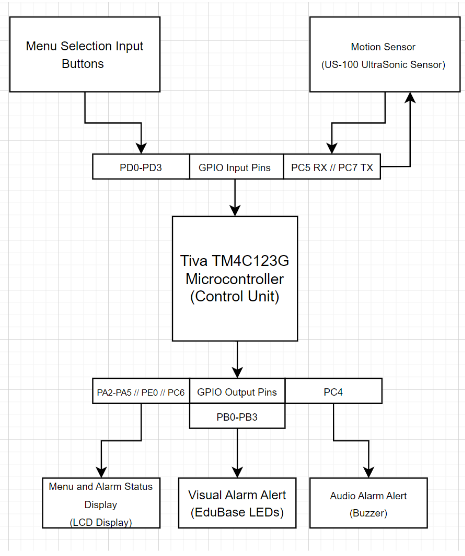

# ECE 425 Final Project
**CSU Northridge**

**Department of Electrical and Computer Engineering**

Adrian Solorzano 

Introduction: 
The goal of this project is to design a Home Security System 
that will allow the user to arm and disarm the system with a 
predetermined security code entered via the EduBase board. 
Once armed, the system will monitor an entry point and detect movement using sensors, 
primarily an ultrasonic sensor. When triggered, the system will display a warning on the LCD, 
sound the buzzer at regular intervals, and activate flashing LEDs to provide a visual alarm. 
The system will remain active until the correct disarming code is entered. This project will 
help to demonstrate skills in microcontroller programming, GPIO handling, interrupts, 
and real-time motion detection, providing an effective and simple security solution.

Results can be found here: 
https://drive.google.com/drive/folders/1-34AhCd78FS8t8-xt7j2R26rrBr-ODtg?usp=sharing

Background and Methodology: 
This Home Security System project applies embedded systems concepts to create a simple,
real-time monitoring system. Key concepts include:
GPIO for handling input from security buttons and sensor
Functions for controlling the buzzer alarm and LED on or off status
Interruption Routine to respond immediately when sensors are triggered. 
The expected outcome in this project is to create an efficient security system
and display practical skills in microcontroller programming, interrupt handling, 
and real-time monitoring. The ultrasonic sensor, acting as the primary motion detector, 
will be the back-bonesecurity of the system by monitoring any movement within a specified range, 
allowing for a reliable and precise alert system that gets the job done without overcomplications. 
To implement the project, the system will begin with a prompt on the LCD, 
allowing the user to select an option to either arm or disarm the system. 
Once armed, the microcontroller will continuously monitor the ultrasonic sensor and (potential) entry sensors
for any disturbances. If movement or entry is detected, an interrupt will activate 
the alarm sequence: a buzzer will sound at intervals, LEDs will flash to provide a visual alert, 
and a warning will display on the LCD. The system will remain in this alert state for 
ten security alert cycles, afterwards returning to a state of disarm, allowing the user to 
create a simple security system using methods we have learned during the course of the semester. 

